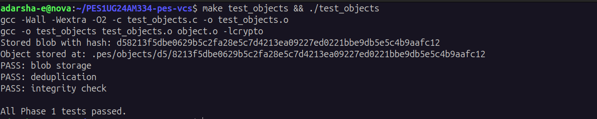
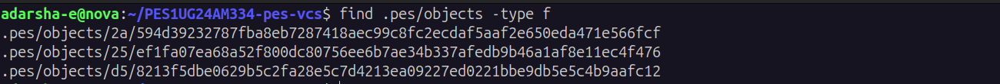
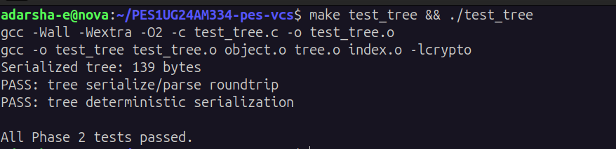
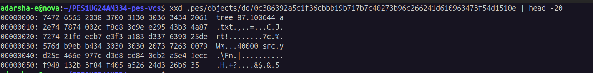
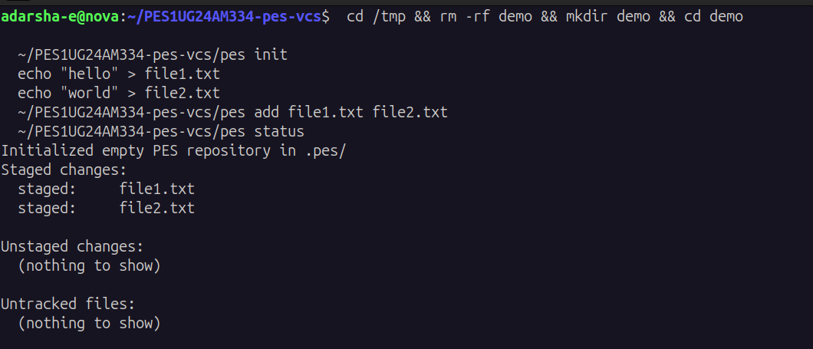
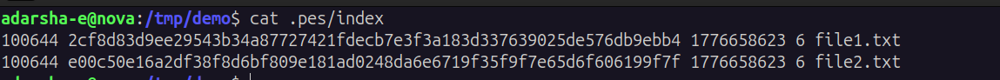
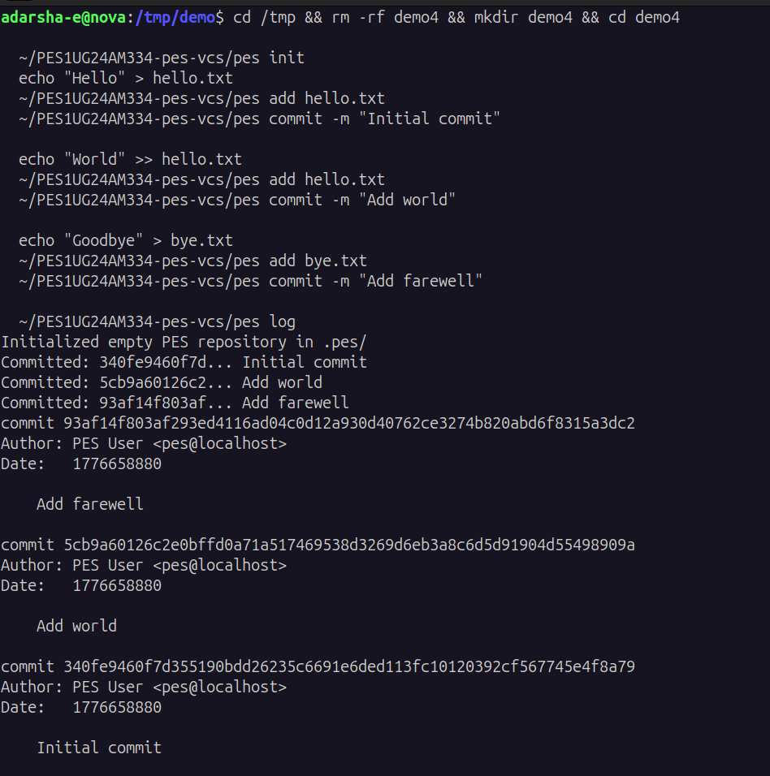
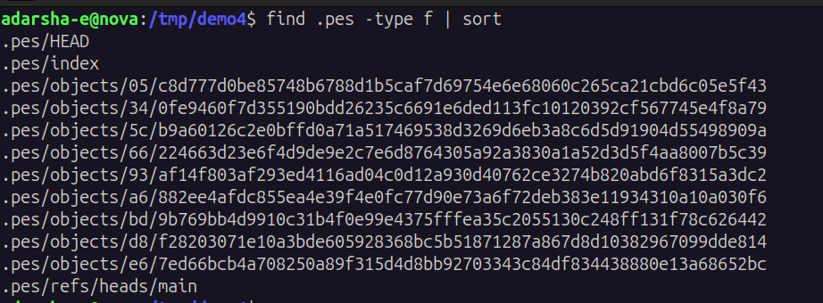
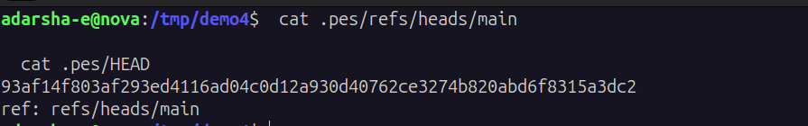

# PES-VCS Lab Report

**Author:** Adarsha (PES1UG24AM334)
**Course:** Operating Systems / Filesystems Lab
**Repository:** PES1UG24AM334-pes-vcs

---

## Overview

This report documents the implementation of PES-VCS, a Git-style local
version control system built from scratch in C. All four implementation
phases were completed:

- **Phase 1 — Object Store:** `object_write`, `object_read` with SHA-256
  content addressing, sharded storage, atomic writes (temp + fsync +
  rename), deduplication, and integrity verification.
- **Phase 2 — Tree Objects:** `tree_from_index` recursively builds a
  hierarchical tree from a sorted index, grouping entries by directory
  prefix and writing each subtree to the object store.
- **Phase 3 — Index:** `index_load` parses the text-format index,
  `index_save` performs an atomic write, and `index_add` reads a file,
  stores the blob, and updates the index entry.
- **Phase 4 — Commits:** `commit_create` builds a tree from the index,
  reads HEAD as the parent (if any), serializes the commit object, and
  atomically updates the branch reference.

---

## Phase 1 — Object Storage Foundation

### Screenshot 1A — `./test_objects` output

```

```

### Screenshot 1B — sharded directory layout

```

```

---

## Phase 2 — Tree Objects

### Screenshot 2A — `./test_tree` output

```

```

### Screenshot 2B — raw tree object hex dump

```

```

---

## Phase 3 — Index (Staging Area)

### Screenshot 3A — init/add/status sequence

```

```

### Screenshot 3B — `cat .pes/index`

```

```

---

## Phase 4 — Commits and History

### Screenshot 4A — `./pes log` with three commits

```

```

### Screenshot 4B — object store growth

```

```

### Screenshot 4C — reference chain

```

```

### Final — full integration test

```
.png)
.png)
```

---

## Phase 5 — Analysis: Branching and Checkout

### Q5.1 — Implementing `pes checkout <branch>`

Three things must change inside `.pes/`:

1. **`.pes/HEAD`** is rewritten to `ref: refs/heads/<branch>`.
   That single line redirects every future `head_read` / `head_update`
   to the new branch file.
2. **`.pes/refs/heads/<branch>`** must exist. If it does not, checkout
   either fails ("branch not found") or, with a `-b` flag, is created
   pointing at the current commit hash.
3. **`.pes/index`** is rebuilt from the target commit's tree so that
   `pes status` reflects the new baseline rather than the old branch's
   staging area.

The working directory must then be **synchronised with the target
tree**:

- For every entry in the target tree that differs from the current
  working copy, write its blob contents back to disk at the correct
  path with the correct mode.
- For every path tracked by the *current* branch but absent from the
  target tree, delete it from disk.
- Create directories as needed; remove now-empty directories.

**What makes this complex:**

- *Recursive tree traversal:* every subtree must be loaded, parsed, and
  walked to enumerate the file set.
- *Three-way reasoning:* the operation must compare the old tree, the
  new tree, and the actual working directory simultaneously.
- *Dirty file detection:* changes the user has not committed must not
  be silently overwritten (see Q5.2).
- *Mode and permission handling:* executable bits must round-trip.
- *Atomicity:* if checkout fails halfway, the user must not be left in
  a half-old, half-new state. Real Git stages the new tree to a
  temporary index file and only swaps it in on success.
- *Untracked file collisions:* a new branch may want to create a file
  that already exists untracked locally. Checkout must refuse rather
  than clobber it.
- *Concurrency:* a second `pes` invocation in the same repo can
  corrupt HEAD or the index unless a `.pes/index.lock` style lock file
  is taken.

### Q5.2 — Detecting a dirty working directory

The index already stores, for every tracked file, the staged blob
hash plus `mtime` and `size`. Detection is a two-stage check that
mirrors what `index_status` already does:

1. **Cheap metadata pass.** For each entry in the index, `lstat()` the
   working-tree path. If `st_mtime != entry.mtime_sec` or
   `st_size != entry.size`, the file is potentially modified. If
   metadata matches exactly, the file is assumed clean — this is the
   fast path and is what `git status` exploits.
2. **Authoritative content pass (only for "potentially modified"
   files).** Read the file, compute the SHA-256 of `"blob <size>\0" +
   contents` exactly the way `object_write` does, and compare to the
   index entry's `hash`. If the hashes match, the file is clean and we
   can safely refresh `mtime_sec` in the index. If they differ, the
   file is **genuinely dirty**.

A file is a *checkout-blocking conflict* if, and only if:

- it is dirty by the test above, **and**
- the corresponding entry in the *target* tree has a different blob
  hash than the *current* index entry.

In other words: only refuse checkout when the user's uncommitted
changes would actually be lost. Files that differ between branches but
match the working copy are harmless. Files that the user has changed
but which are identical between branches are also harmless.

The object store's content addressing makes the comparison trivial:
two blobs are identical *iff* their hashes are equal. No byte-by-byte
diff is ever required.

### Q5.3 — Detached HEAD

In our format, `.pes/HEAD` normally contains `ref: refs/heads/main`.
A *detached* HEAD instead contains a raw 64-character commit hash on
its first line, with no `ref:` prefix. The provided `head_read` and
`head_update` already handle both cases — `head_update` writes
directly to `HEAD` when no branch reference is present.

**What happens if you commit while detached:** `commit_create` still
succeeds. A new commit object is written, its parent is the
previously-detached commit, and `head_update` overwrites `.pes/HEAD`
in place with the new hash. The chain is intact and walkable, but it
has *no branch name pointing at its tip*. The moment the user runs
`pes checkout <some-branch>`, `.pes/HEAD` is overwritten with `ref:
refs/heads/<some-branch>` and the only pointer to that detached
chain disappears. The commits themselves still exist as objects, but
they become unreachable and therefore eligible for garbage collection
(see Q6.1).

**Recovery before GC runs:**

- The user can read the previous HEAD value out of `.pes/HEAD`'s
  on-disk history if it was version-controlled, or out of a "reflog"
  if one exists. Real Git records every HEAD movement in
  `.git/logs/HEAD`; the user runs `git reflog` and checks out the
  hash of the lost tip.
- If no reflog exists (PES-VCS does not implement one), the user can
  still recover by enumerating commit objects in
  `.pes/objects/*/`*  with `cat-file -t`-style logic, identifying any
  whose hash is *not* reachable from any branch ref, and creating a
  new branch at the commit they want: `echo <hash> >
  .pes/refs/heads/rescue`.

**Recovery after GC:** the commits are gone permanently. This is why
real Git keeps the reflog by default and refuses to GC objects
younger than two weeks unless `--prune=now` is passed.

---

## Phase 6 — Analysis: Garbage Collection and Space Reclamation

### Q6.1 — Finding and deleting unreachable objects

A mark-and-sweep over the object DAG:

**Mark phase.** Build the set of *root* hashes — every commit hash in
`.pes/refs/heads/*`, plus the commit hash from `.pes/HEAD` if it is
detached, plus (in real Git) tags, the reflog, and any open
`packed-refs` entries. Push these onto a worklist. Pop one hash at a
time, mark it reachable, and enqueue its references:

- A **commit** references its `tree` and its `parent` (if any).
- A **tree** references every blob and every subtree listed in its
  entries.
- A **blob** references nothing — it is a leaf.

Continue until the worklist is empty.

**Sweep phase.** Walk `.pes/objects/XX/YYYY...` on disk. For every
object file, if its hash is not in the reachable set, `unlink()` it.
Remove now-empty shard directories.

**Data structure for "reachable":** a hash set keyed by the 32-byte
binary hash. In C: an open-addressed hash table with the binary hash
itself as the key (the hash is already uniformly distributed, so the
"hash function" is just "take the first 8 bytes as a `uint64_t`").
Lookup and insert are O(1) expected; memory is ~40 bytes per
reachable object. For a repo with N reachable objects, the table
costs ~40N bytes — for N = 1,000,000 that is ~40 MB, easily fits in
RAM.

**Estimate for 100,000 commits, 50 branches:**

- 100,000 commits, but each commit-walk traversal stops at the first
  already-marked commit. Across all 50 branches, the total *unique*
  commits visited is bounded by 100,000.
- Each commit references exactly one root tree. In the worst case
  every commit has a *different* root tree (no shared snapshots); in
  practice trees are shared across consecutive commits whenever the
  directory was unchanged. Assume worst case: 100,000 root trees.
- Each root tree references on the order of (project depth) ×
  (entries per directory) subtrees and blobs. For a moderate project
  with ~5,000 files arranged in ~500 directories, a snapshot is ~5,500
  objects. Most are *shared* across snapshots; a typical commit
  introduces only ~10–100 new tree+blob objects.
- Realistic total visited: roughly **100,000 commits + 100,000 root
  trees + ~5,500 base objects + ~50 × 100,000 incremental
  objects ≈ a few million objects** in the worst case, dominated by
  the per-commit deltas.

Time complexity is `O(reachable objects)`, not `O(stored objects)`,
because the hash set guarantees we never re-traverse a marked node.

### Q6.2 — Race condition between GC and concurrent commit

Consider this interleaving:

1. The user runs `pes commit`. `commit_create` calls
   `tree_from_index` and `object_write` — a brand new blob, say
   `blob B`, lands at `.pes/objects/ab/cd...`. Then a new tree
   `tree T` is written that *references* `blob B`. `T` is also
   written to disk.
2. **Before** `commit_create` calls `head_update`, GC starts in
   another process. GC walks the refs. None of them point to `T` yet
   (HEAD has not been updated). `T` and `B` are therefore *not* in
   the reachable set.
3. GC's sweep phase `unlink()`s both `T` and `B` from
   `.pes/objects/...`.
4. The commit process now calls `head_update`, which writes the new
   commit hash to `refs/heads/main`. The repository is permanently
   corrupted: `main` points at a commit whose tree is gone, whose
   blobs are gone, and whose objects can no longer be read.

The danger is fundamental: the *act of creating an object* and the
*act of making it reachable* are two distinct filesystem operations,
and the window between them is exactly when GC can prune the new
object.

**How real Git avoids this:**

- **Grace period.** `git gc` by default refuses to delete loose
  objects younger than two weeks (`gc.pruneExpire`). A new object
  written seconds ago is well under this threshold, so the race
  above cannot prune it. The user has to opt in with `--prune=now`.
- **`gc.lock` file.** Long operations take a per-repo lock. Other
  Git operations notice the lock and either wait or warn.
- **Commit-graph and reflog roots.** `git gc` treats *every* hash
  ever recorded in the reflog as a root, so even mid-operation
  intermediates that were briefly pointed at by `ORIG_HEAD` etc. are
  protected.
- **Atomic ref updates with `update-ref`.** Combined with the grace
  period, this means the only way to prune a freshly-written object
  is to deliberately ask for it — and at that point the user is
  responsible.

A simpler alternative implemented by some systems: take an
**exclusive flock on `.pes/objects/`** during both commit's
object-write phase and GC's sweep phase. Cheap, but it serialises all
writers against the GC pass.

---

